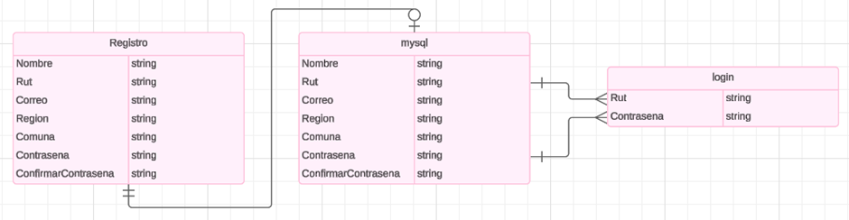
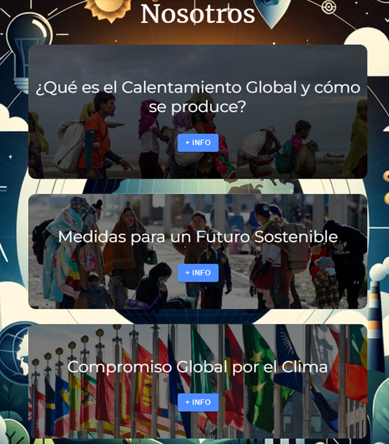
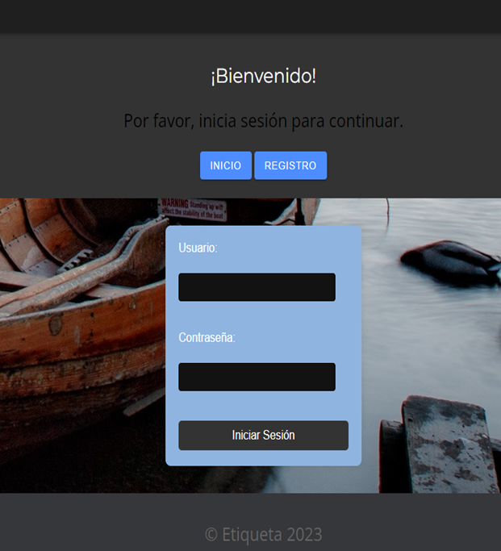
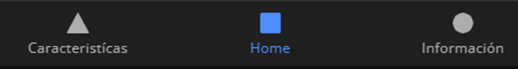

Algunos de los UI implementados:
●	La página principal
●	los botones de información para saber las características del proyecto
●	los botones de información para descubrir e informarse del tema del proyecto
●	formulario de inicio de sesión
●	formulario de registro de sesión

EP2.2 Hacer lectura de datos desde un archivo JSON (puede ser local, o alguna fuente externa de datos), y mostrarlos en alguna de las pantallas.

Implementamos un archivo json que se compone de la siguiente forma

"username": "prueba para el json no me borres",
    "rut": "12345678-9",
    "email": "usuario@example.com",
    "region": "region7",
    "comuna": "Santiago",
    "password": "contraseña123",
    "confirm_password": "contraseña123"
 
cuya función es guardar información del usuario y transferirlo a distintos servidores con el objetivo de cumplir la validación e inicio de sesión del usuario
a continuación lo mostramos dentro de una celda en la apgina de registro. su propósito de mostrarlo en pantalla es para verificar que se puede leer correctamente en una página.

EP2.3 Definir estructura de datos inicial de la aplicación, y definir la estructura de la base de datos, y el modelo de datos. Algunos motores de bases de datos que se pueden utilizar son: MySQL, PostgreSQL, SQLite, MongoDB, Firebase, entre otros.

Estructura de datons inicial de la aplicacion:

●	Eco_mundo: Es una lista (array) que contiene objetos. 
○	nombre: Nombre del usuario.
○	rut: Identificación única del usuario (en formato chileno).
○	correo: Dirección de correo electrónico del usuario.
○	region: Región en la que reside el usuario.
○	comuna: Comuna en la que reside el usuario.
○	password: Contraseña del usuario (almacenada de forma segura, por ejemplo, hash).
○	Confirme_password: Confirmación de la contraseña (debe coincidir con el campo "password").

Estructura de Bas de datos:

INSERT INTO `datos` (`nombre`, `rut`, `correo`, `region`, `comuna`, `contraseña`, `confirmar contraseña`)

VALUES ('', NULL, '', '', '', '', '')

Modelo de datos: 

EP2.4 Hacer uso de al menos dos (2) patrones de diseño, ya sea web o móvil, en la implementación de las pantallas, teniendo como foco principal el uso desde un dispositivo móvil.

Hacemos uso en este proyecto de varios patrones de diseño a continuación mencionaremos algunas:

●	Uso de etiquetas: en páginas como mostramos en la siguiente imagen aplicamos este patrón con el objetivo de adaptar a diferentes tamaños de pantalla debido a su alta flexibilidad a distintos tamaños pensando en tamaños de distintos dispositivos móviles.

●	Botón de inicio: Insertamos botones de inicio en varias páginas para poder devolverse de la página anterior a la ingresada para mayor comodidad de navegación. Pensamos en dispositivos móviles en las que no tengan implementado cómodamente botones de retroceso facilitandoles la navegación en nuestra página web 

●	La barra de navegación fija en la parte inferior: Usamos este patrón en el que servirá a los usuarios especialmente a los que tengan dispositivos móviles para poder manejarse de forma rápida y cómoda a puntos principales de nuestra página. se mantiene en la parte inferior para mayor comodidad de pulgar mientras se sostiene el dispositivo móvil

•	Texto de acceso rapido: Incluimos texto en la que da atajos a tematicas principales que ofrece nuestra pagina pensando en personas que no se familiarizan con la navegacion en web dando mas alternativas a todos los usuarios.

Cosas a considerar de nuestro proyecto y de su ejecución:

La base de datos esta funcional pero se trabajo con una carpeta externa a la carpeta del trabajo por pruebas por lo que el codigo no da direcciones compatibles con la carpeta, a futuro si se arreglara pero ahora en enfoque fue forma la estructura y familiarizarse con el concepto de base de datos en nuestro proyecto.

los botones de submit en registro e inicio de sesion no son funcionales ya que estan pensados para actuar en conjunto con una base de datos funcional.

El aspecto estetico todavia no esta en fase final por lo que hay algunos diseños que pueda que no se vean bien aún.

Agregamos la carpeta data en la que almacenaran los json y los datos que serán partícipes en el flujo de datos de nuestra pagina.